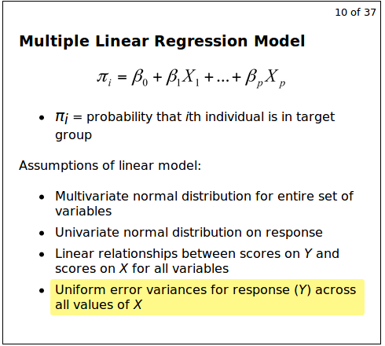

```{r setup, include=FALSE}

knitr::opts_chunk$set(echo = TRUE)

```

#### Regression

Multiple Linear Regression Model

    πi = probability that ith individual is in target group

Assumptions of linear model:

    Multivariate normal distribution for entire set of variables
    Univariate normal distribution on response
    Linear relationships between scores on Y and scores on X for all variables
    Uniform error variances for response (Y) across all values of X
    

    
    
won't be the case if we just keep the probability there
so we use a logit function - transform the probability
residuals will not be normally distributed and they will have a nonconstant variance

if we try to do a MLR when our response is a probability rather than when the response is quantitative

create a 
